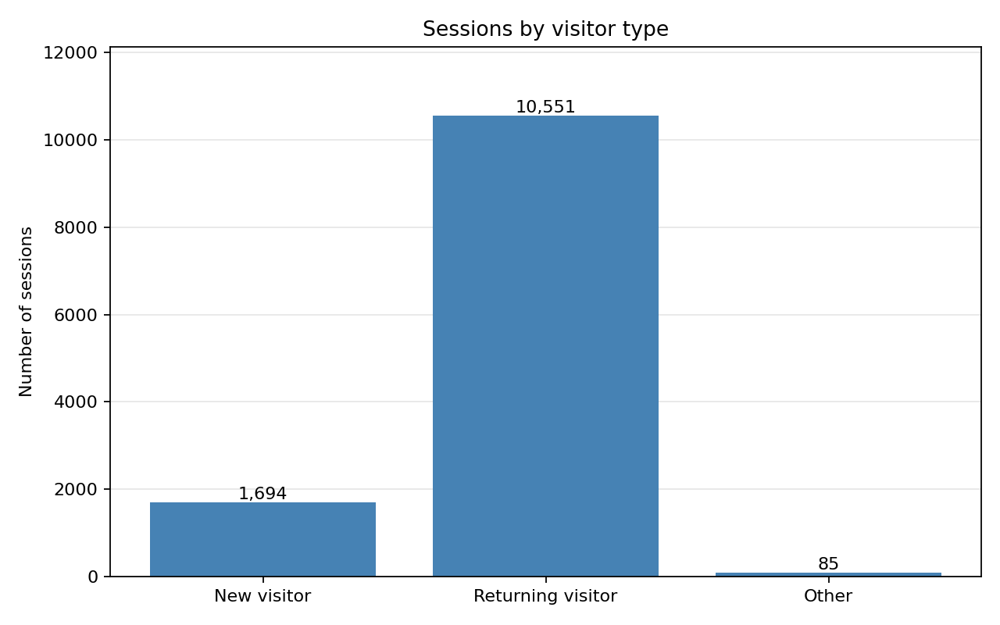
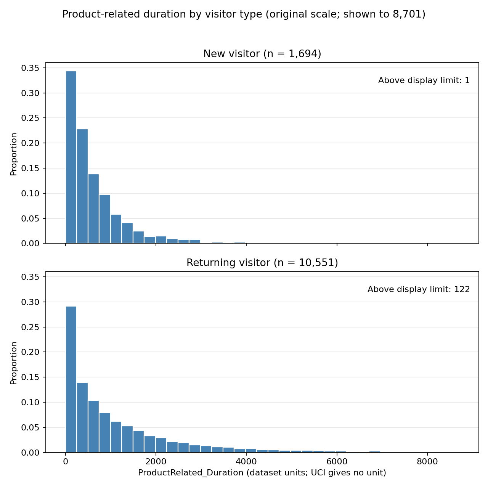
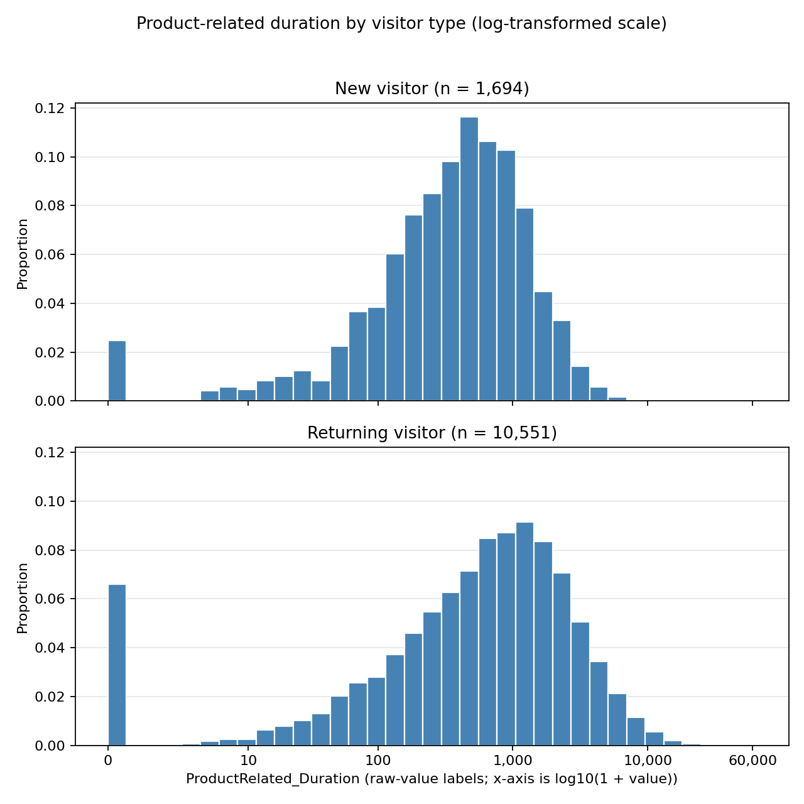
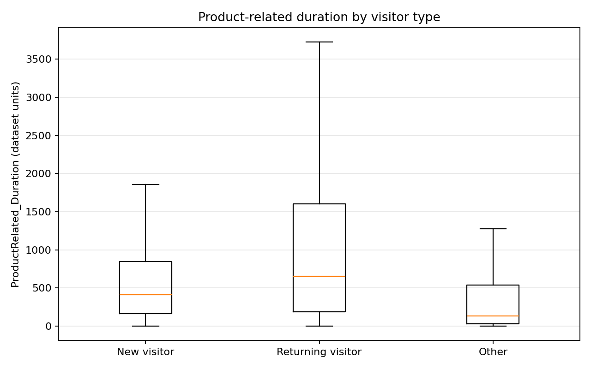

# STAT1008 Online Shopping Project: EDA Report

**Purpose:** A working report for the group to review, reproduce, and adapt. It reports descriptive results from the original UCI CSV and Matplotlib plots. The group still needs to check these outputs and complete the required hypothesis test in Excel. Follow the course AI-use declaration and originality requirements before using any material in the presentation.

## Research question

**Do new and returning online shoppers differ in their average time spent viewing product-related pages during an online shopping session?**

The observational unit is one online-shopping session/user record. The explanatory variable is VisitorType. The response is ProductRelated_Duration. For the two-group comparison, use New_Visitor and Returning_Visitor only; keep Other as a separate category in the descriptive work and do not merge it into either group.

## Dataset and source

The analysis uses the CSV provided by the original UCI Machine Learning Repository entry for dataset 468, *Online Shoppers Purchasing Intention Dataset* [1]. The CSV is included unchanged in this package at data/online_shoppers_intention.csv. UCI describes the data as 12,330 sessions and states that sessions in the one-year collection period were assigned to different users to avoid a tendency tied to a campaign, special day, user profile, or period. UCI does not state exact calendar start/end dates, identify the e-commerce business, or document a sampling frame. The duration variables have no unit stated in UCI's variable table, so values below are reported in **dataset units**, not seconds.

UCI describes the original dataset as suitable for classification/clustering and identifies Revenue as a possible class label. That original task description does not change this project: the present question is a descriptive and inferential comparison of two means, not a prediction task.

### Population and observational unit

The observational unit is one session record (UCI says each session in the one-year dataset belongs to a different user). The intended population means are the average ProductRelated_Duration for new-visitor sessions and returning-visitor sessions in the population the data are meant to represent. Because UCI does not specify the site identity, sampling frame, or recruitment/selection process, the broader target population cannot be defined confidently; avoid claiming the results represent all online shoppers.

### Facts from the UCI description and checks of the downloaded CSV

| Item | Finding | Basis |
|---|---|---|
| Source | UCI Machine Learning Repository, dataset 468 | UCI entry and included original CSV [1] |
| Row count and columns | 12,330 records and 18 columns in the downloaded CSV | Direct CSV check; UCI describes 12,330 sessions |
| Collection period | UCI describes a one-year period; exact dates are not documented in the entry | UCI additional information [1] |
| Missing values | UCI reports none; the CSV check found 0 missing cells | UCI entry and direct CSV check [1] |
| VisitorType counts | New_Visitor: 1,694; Returning_Visitor: 10,551; Other: 85 | Direct count of the raw CSV, before calculating duration summaries |
| Main two-group records | 12,245 when restricted to New_Visitor and Returning_Visitor | Direct count; Other remains excluded from that comparison |
| Exact repeated rows | 125 repeated full-row records detected by exact row equality | Direct CSV check; the file has no session ID to investigate them further |

UCI's prose describes visitor type as returning or new, while the raw CSV also contains 85 records coded Other. The repository description does not explain what Other means. It is reported separately here and excluded from the specified two-group comparison. UCI says records represent different users, but because the CSV contains no session identifier, the 125 identical feature rows cannot be confirmed as either repeated sessions or coincidentally identical records. They have not been deleted.

## Suitability for the STAT1008 project

The assignment requires raw individual-level data, recommends at least 30 observations, asks for at least four variables, and requires observations to be independent for the course hypothesis-testing tools [2, pp. 2–4]. This dataset is a reasonable fit with caveats:

- **Individual/session-level:** Each CSV row is a session record, not an aggregate monthly mean. It meets the handout's raw-data requirement.
- **Sample size and variables:** The raw file has 12,330 records and 18 columns. The specified New/Returning comparison has 12,245 records, well above 30. More than four useful variables are available.
- **Independence:** UCI states that each session belongs to a different user during the one-year period, which supports treating sessions as distinct units. A sampling design is not described, and the exact duplicate rows should be raised as a data-quality point rather than silently removed.
- **Not a conventional time series:** The file is a multivariate session table. Month is a categorical session attribute; records are not regularly spaced observations of one quantity over time.
- **Question and method:** The question directly concerns two population means and fits a two-independent-group mean comparison at the level of the course. The group should use the exact method and assumptions taught in STAT1008. The strong right skew and extreme values shown below should be acknowledged; this report does not calculate a test statistic, p-value, or inferential conclusion.

## Variables

UCI describes the dataset as having 10 numerical and 8 categorical attributes. Definitions below follow its additional variable information where provided; the downloaded CSV is used to check the observed data type and coding [1].

| Variable | Definition from UCI or direct data check | Type | Role here |
|---|---|---|---|
| **VisitorType** | UCI describes visitor type as returning or new. The CSV contains New_Visitor, Returning_Visitor, and Other. UCI's prose does not define Other. | Categorical | Grouping variable. Compare New_Visitor with Returning_Visitor; keep Other separate and out of the two-group test. |
| **ProductRelated_Duration** | UCI says the “Product Related Duration” feature is the total time spent in product-related pages in the session. UCI does not specify the unit. | Numerical, continuous | Response variable; summarize the dataset values without assigning a unit. |
| **ProductRelated** | UCI says this feature records the number of product-related pages visited in the session. | Numerical, discrete count | Additional session context; not part of the primary two-group comparison. |
| **BounceRates** | UCI defines the underlying bounce-rate metric as the percentage of visitors who enter through a page and leave without triggering another analytics-server request in that session. | Numerical, continuous in UCI schema | Context only; not part of the main test. |
| **ExitRates** | UCI defines the underlying exit-rate metric as the percentage of pageviews to a page that were the last pageview of the session. | Numerical, continuous in UCI schema | Context only; not part of the main test. |
| **PageValues** | UCI describes this as the average value for a web page visited before an e-commerce transaction. The UCI schema labels it Integer, while values in this CSV include decimals. | Numerical in the CSV | Context only; not part of the main test. |
| **Revenue** | Boolean target/class-label field. UCI identifies Revenue as usable as the class label; the dataset description counts sessions that did or did not end with shopping. | Categorical, binary/Boolean | Possible purchasing-intention context; not a response or grouping variable in this question. |
| **Weekend** | Boolean value indicating whether the visit date was on a weekend. | Categorical, binary/Boolean | Session context; could be considered when discussing potential differences between groups. |
| **Month** | Month of the year associated with the session. UCI does not give exact calendar dates for the one-year collection period. | Categorical | Session context / possible source of group differences; not a time-series index for this analysis. |

## Exploratory data analysis

The summary below uses the unmodified session records. Descriptive calculations include Other as its own row; the hypothesis comparison should use only New_Visitor and Returning_Visitor. Means and standard deviations are calculated from the original response values; quartiles use the standard 25th, 50th, and 75th percentiles. Values are rounded for display.

### Visitor group counts

| Visitor type | Sessions | Share of all sessions |
|---|---:|---:|
| New_Visitor | 1,694 | 13.74% |
| Returning_Visitor | 10,551 | 85.57% |
| Other | 85 | 0.69% |

**Question:** How many sessions are in each visitor category, and how balanced are the two comparison groups? **Observed pattern:** Returning_Visitor is much more common than New_Visitor in this file. Other has 85 records and remains a separate category. The difference in group sizes is important context for the later test.

### Product-related duration summary

| Visitor type | n | Mean | Median | Sample SD | Q1 | Q3 |
|---|---:|---:|---:|---:|---:|---:|
| New_Visitor | 1,694 | 636.39 | 414.25 | 766.34 | 166.55 | 846.01 |
| Returning_Visitor | 10,551 | 1,289.42 | 655.54 | 2,027.44 | 191.00 | 1,605.73 |
| Other | 85 | 570.40 | 136.50 | 1,264.15 | 29.50 | 537.63 |

All duration values are in **dataset units** because UCI does not specify a unit. The ranges (minimum to maximum) are 0.00 to 12,983.79 for New_Visitor, 0.00 to 63,973.52 for Returning_Visitor, and 0.00 to 9,630.21 for Other. There are 42, 696, and 17 zero-duration records in those groups, respectively. By the exploratory rule of Q3 plus 1.5 times the interquartile range, 104 New_Visitor, 794 Returning_Visitor, and 10 Other values are above their group's upper fence. These are flags for review, not confirmed errors.

The Returning_Visitor sample mean is 653.03 dataset units higher than the New_Visitor sample mean; their sample medians are 655.54 and 414.25. These are descriptive sample differences only. They do not establish a population difference or a causal effect.

### Shape and group comparison

The next two figures compare the two groups named in the research question. In each figure, New_Visitor is the top panel and Returning_Visitor is the bottom panel. Both use the same bin edges within each figure. The y-axis shows the proportion of each group's sessions in each bin, so Returning_Visitor's larger sample size does not automatically produce taller bars.

**Question:** How do the distributions compare over the main range of the original values? **Observed pattern:** Both groups have many observations near zero and long right tails. To make the central part readable, the shared x-axis ends at the pooled 99th percentile of the two groups (about 8,701 dataset units). One New_Visitor and 122 Returning_Visitor observations lie above this display limit. They remain in the data and in all summary calculations.

**Question:** Does the long upper tail make the two distributions hard to compare on the original scale? **Observed pattern:** The log-transformed histograms display more of the upper tails for both groups, while retaining zero values by plotting log10(1 + duration). Returning_Visitor values extend farther into the upper tail. The x-axis labels show raw dataset values; only the plotted positions are transformed. Read this alongside the original-scale histogram and summary table, since the research question concerns means on the original values.

Across the full dataset, the mean is 1,194.75 and the median is 598.94. The maximum is 63,973.52, much larger than the overall third quartile of 1,464.16. Within each visitor category, the mean is also higher than the median. These summaries indicate strong right skew and extreme values. The 1.5-IQR flags do not by themselves show that any record is wrong or should be removed.

**Question:** How do the medians and middle 50% of duration compare across visitor categories? **Observed pattern:** Returning_Visitor has the higher median in this sample. Other remains separate. Points beyond the boxplot whiskers are hidden only to keep the plot readable; every record is retained in the data and the numerical summaries above.

## Main comparison and what remains to be done

The population parameters are the mean session-level ProductRelated_Duration for New_Visitor shoppers, μ_New, and for Returning_Visitor shoppers, μ_Returning. The specified two-sided hypotheses are:

$$H_0: \mu_{\text{New}} = \mu_{\text{Returning}}$$

$$H_A: \mu_{\text{New}} \neq \mu_{\text{Returning}}$$

This report does **not** give the test statistic, critical value, p-value, or test conclusion. The group should calculate those in Excel using the two-independent-sample mean-test method taught in STAT1008, show the intermediate quantities requested by the handout, and verify how the course method handles standard error and degrees of freedom. Use the assigned significance level and Excel probability function in the presentation. Do not treat the visual or sample-mean difference above as a test result.

## Limitations to carry into the presentation

- These are observational session records, not randomized assignments. Any detected group difference would be an association, not evidence that returning status causes longer or shorter viewing time.
- The source does not identify the e-commerce business, exact calendar dates, or sampling frame. Generalization beyond the represented UCI data is uncertain.
- UCI states sessions belong to different users, but the CSV has no session ID or sampling details. Exact repeated rows require a cautious note; they have not been removed.
- UCI does not specify units for ProductRelated_Duration. Avoid labeling values as seconds unless the group finds a clear authoritative source and the tutor approves its use.
- The groups are highly unequal in size, and duration is strongly right-skewed with extreme values. Means are sensitive to the upper tail; report median and spread alongside means while retaining the mean as the question's response summary.
- Month, Weekend, ProductRelated, traffic type, browser/operating system, region, Revenue/purchasing outcome, and other session characteristics may relate to both visitor type and duration. This two-group comparison does not adjust for them.
- The small Other category is not included in the two-group hypothesis test. The UCI description does not explain this category.

## References

1. Sakar, C. and Kastro, Y. (2018) *Online Shoppers Purchasing Intention Dataset* [Dataset]. UCI Machine Learning Repository. Available at: https://doi.org/10.24432/C5F88Q (Accessed: 27 September 2026).
2. Research School of Finance, Actuarial Studies and Statistics (2026) *STAT1008 Quantitative Research Methods: Group Presentation Project*. Semester 2 course handout, pp. 2–4.

## Files and reproduction

The included plot_eda.py script reads the supplied raw CSV, prints the VisitorType counts first, saves the descriptive summary tables, and regenerates all four Matplotlib figures. Run it with Python 3 and pandas, numpy, and matplotlib installed. The script performs descriptive EDA only; it does not calculate the hypothesis test.

The group should independently check the formulas, counts, plot interpretations, course procedure, and final wording before presenting. This document is a working aid rather than a completed submission.
